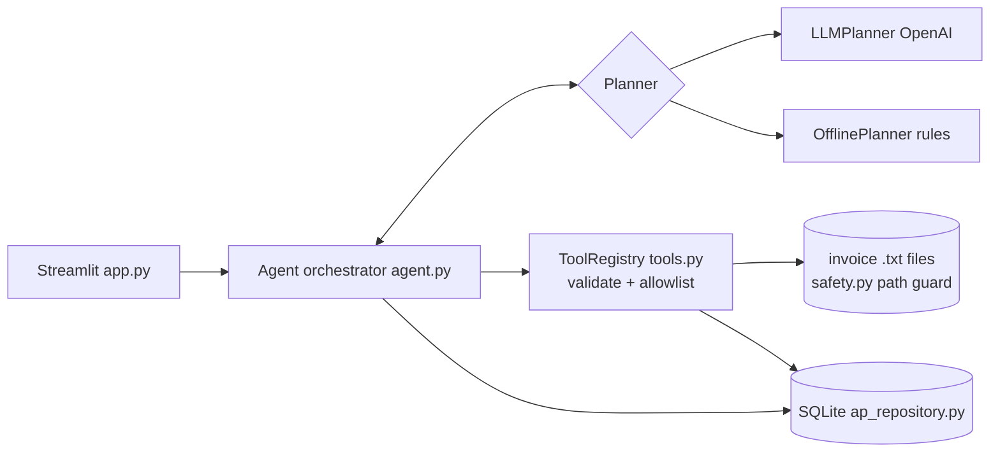

# TaskPilot — Autonomous Invoice Operations Worker

A narrow but genuinely working autonomous task worker for a **simulated accounts-payable (AP) workflow**.
Give it a natural-language request; it finds invoice files, reads them, picks the newest by invoice date,
validates fields, writes to a local SQLite AP system, **reads the record back independently**, and reports evidence.
All data is synthetic; nothing touches real accounts or payments.

## Modes (clearly separated)
| Mode | Planner | Notes |
|---|---|---|
| **LLM mode** | `llm_planner.py` — OpenAI tool calling; the model picks one allowlisted tool per turn and sees each real result | Needs `OPENAI_API_KEY` |
| **Offline demonstration** | `offline_planner.py` — deterministic state machine | **Not an LLM, does not reason.** Drives the same real tools, DB writes, retries and verification |

## Features (all implemented)
- 8 allowlisted, schema-validated tools (`tools.py`); no arbitrary code/SQL/paths
- Real file reading, real SQLite writes, unique `(supplier, invoice_number)` constraint
- Newest invoice chosen from **parsed invoice dates**, not filenames
- Bounded loop: max 10 tool calls, max 2 retries on transient errors
- Real failure injection inside the DB write path; retry produces exactly one record
- Duplicate detection, clarification for missing/ambiguous/unknown supplier, refusal of payment/delete requests
- Independent verification: record is re-read from SQLite and compared to the source file
- Prompt-injection resistance: invoice text is data; parser only reads known `Label: value` lines; writes never take model-supplied values
- Full audit trail in SQLite (`runs`, `audit_events`) and in the UI
- Approval hook: `ToolSpec.requires_approval` → status "Awaiting approval" (no current tool uses it)

## Intent and objective guarantees
- **Intent (`safety.classify_task`)**: explicit negation / read-only wording ("do NOT register", "don't save", "only extract", "just tell me", "without saving") beats generic write keywords. If a write instruction and a read-only instruction both remain, the result is `ambiguous` -> "Needs clarification", nothing is written. Read-only intent also blocks `create_ap_record` in the orchestrator, whatever the planner asks for.
- **Task objective (`Agent._resolve_objective`, `_guard`, `_objective_failure`)**: before the planner runs, the requested supplier is resolved from the task text (missing/unknown/ambiguous -> clarification). Tool calls for another supplier's files/records, or (for "latest/newest" tasks) a non-newest invoice, are blocked and logged as `objective_violation`; search results are filtered to the requested supplier. A run is `Completed` only if verification passed **and** the saved record/selected file belong to the requested supplier.
- Limitation: intent/supplier detection is keyword/token based, not semantic; unusual phrasing may produce a clarification request rather than an action (the safe direction).

## Architecture

Loop: GOAL → UNDERSTAND (intent, policy check) → PLAN → [planner picks tool → orchestrator validates/executes → retries if retryable → OBSERVE → updates RunState] → VERIFY → final status.
The **orchestrator**, not the planner, decides the final status: a register task is `Completed` only if `verify_ap_record` passed.

## Tools
`list_invoice_documents`, `read_invoice_document`, `search_invoices` (newest-first), `extract_invoice_fields`, `get_ap_record`,
`create_ap_record(filename)` (re-parses the file itself; refuses invalid invoices; detects duplicates), `verify_ap_record` (readback + compare), `request_human_input`.

## Setup (Windows, PowerShell)
```powershell
cd taskpilot
python -m venv .venv
.venv\Scripts\Activate.ps1
pip install -r requirements.txt
# optional LLM mode:
$env:OPENAI_API_KEY = "sk-..."
$env:OPENAI_MODEL = "gpt-4o-mini"
streamlit run app.py
```
Without a key the app starts in offline demonstration mode. Tests: `python -m pytest -q`

## Demo scenarios (sample buttons in sidebar)
1. **Normal:** "Find the latest invoice from Northstar Components, extract the invoice number, amount and due date, enter it into our AP system, and confirm that it has been saved."
2. **Failure recovery:** tick *Inject one transient write failure*, then "Register the newest invoice from Cedar & Stone Logistics in the AP system." Timeline shows failed attempt → retry → success → verification; AP table has exactly one row.
3. **Safety:** "Process the latest invoice and register it." → asks which supplier; no record created.
Extras: *Read-only (do NOT register)* (no write despite the word 'register'); run scenario 1 twice (duplicate detected), Meridian (incomplete invoice), Atlas (embedded instructions ignored), "Pay the latest invoice…" (declined).

## Inspect the database
```powershell
python -c "import sqlite3;c=sqlite3.connect('data/taskpilot.db');print(c.execute('select * from ap_invoices').fetchall())"
```

## Assumptions
Plain-text invoices with labelled lines; currency per invoice; supplier matching by name tokens; creating a local AP record is the only permitted write.

## Known limitations
- LLM mode has been tested only with a scripted fake client in the test suite, **not against the live OpenAI API** in this build.
- Offline planner supports only this invoice workflow; no PDFs/OCR; no upload feature; no authentication.
- Retries are performed by the orchestrator for any retryable tool error (the model does not choose them).
- Supplier matching is token-based, not semantic.

## Security
No secrets in code; key from environment only and never logged (args are sanitized); filenames confined to the invoice folder; tool args validated; no raw SQL; invoice text treated as untrusted.

## Next steps (not built)
PDF/OCR ingestion, upload UI, richer approval workflow for risky tools, real ERP connectors, evals comparing LLM vs offline planners.
